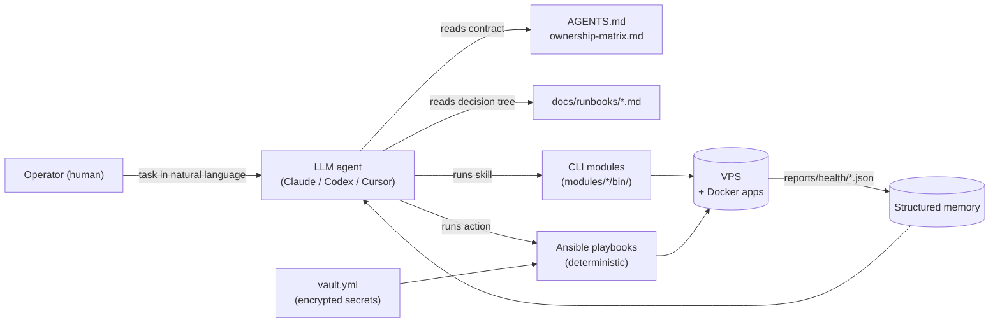

# PraefectusAI


[](LICENSE)
[](https://docs.ansible.com/)
[](#)

**Your AI sysadmin. Under contract.**

PraefectusAI is a digital infrastructure administrator powered by an LLM agent. It operates your Linux VPS under an explicit mandate — narrow scope, deterministic actions, faithful reports back. The repo is its employment contract: the rules it follows, the skills it can use, the boundaries it must not cross, and the journal of everything it has done in your name.

It works with Claude Code, Codex, Cursor, and any LLM agent that follows instructions, through the [`AGENTS.md`](AGENTS.md) contract pattern. Under the hood, the agent's actions are deterministic Ansible playbooks; its skills are CLI tools; its guardrails are Vault + scoped permissions; its memory is structured reports. Bring your own VPS — single host or small fleet — the patterns scale.

---

## What PraefectusAI does for you

You have a VPS. It has problems you don't see.

Disk fills up at 3 AM. A container OOM-kills when you're at dinner. Backups stopped running thirty days ago and you don't know yet. `fail2ban` quietly bans an IP every hour and you're not on the email list. The TLS cert expires next Tuesday and the renewal cron has been broken since March.

These are not interesting problems. They are exactly the problems that ruin a Sunday — and they are exactly the problems an LLM agent can handle better than you, *if* the agent has a contract.

### Hire PraefectusAI

PraefectusAI is your AI sysadmin. It works for you 24/7. It costs you nothing (MIT-licensed). It has a written contract you can read in five minutes ([`AGENTS.md`](AGENTS.md)). And it cannot do the dumb things — they are physically out of scope.

#### Every day, on its own

| Cadence | What happens | Why you care |
|---|---|---|
| every 5 minutes | Health check on disk, memory, swap, load, container restarts. Telegram alert the moment something goes amber. | You learn about a problem before your users do. |
| every Sunday 03:00 UTC | Safe cleanup of apt cache, `journalctl` (capped at 14 d / 500 MB), filtered `docker prune` (`--filter "until=24h"`). **Volumes are never touched.** | Disk-full outages stop happening. |
| every day 02:00 UTC | Encrypted backup of your application data to Backblaze B2 via `restic`. The password is yours alone. | If the VPS dies tomorrow, you lose hours, not weeks. |

You wake up to a green status. Or to a Telegram message that already tells you what's wrong and where to look.

#### When you ask it to

| You say... | The agent does... | You get... |
|---|---|---|
| *"Is everything OK?"* | `verify.sh` | 12-check health gate in five seconds. Structured JSON for trends; human-readable summary for you. |
| *"Free me some disk."* | `10-disk-cleanup.yml --check --diff`, then apply | Dry-run preview, then safe cleanup. Saves you the typing — and protects you from `docker system prune -a` muscle memory. |
| *"Audit the firewall and ports."* | `port-audit` + `firewall.md` review | Live `ss -tlnp` compared with your documented inventory. Anything that drifted is flagged. |
| *"Apply the security baseline."* | `40-security.yml` | `fail2ban` + `unattended-upgrades` (`-security` only) + sshd hardening. Idempotent — run it once or run it weekly, same result. |
| *"How are we trending?"* | `health-trend --last 10` | Disk / memory / swap / restart trends across the last ten reports. Catches slow drifts you'd never spot in a single snapshot. |
| *"Test the alert channel."* | `run-check --test-alert` | A synthetic Telegram notification. Catches a dead bot token *before* you need it for real. |
| *"Show me last month's auto-cleanup."* | `cleanup-fetch` | Aggregates the weekly cleanup logs into one operator-friendly markdown. You see what the agent has done in your name. |

#### What it will not do — by design

These are written into the contract ([`AGENTS.md`](AGENTS.md)). The agent refuses, even if you ask in frustration at 11 PM:

- Touch your application's `docker-compose.yml`. (That's the app owner's zone.)
- Run `docker volume prune` or `docker system prune -a` without `--filter`. (That deletes state.)
- Disable UFW, even "just for a test".
- `git push --force` to `main`.
- Edit `/etc/ssh/sshd_config` directly (only via a role with `validate: sshd -t -f %s`).
- Reboot the VPS without your explicit approval.

Why have these limits at all? **Because trust is built in the things an agent won't do, not the things it can.** A junior sysadmin you'd actually hire is the one who knows what they should escalate.

### Who it's for

You. If you have:

- One Hetzner / DigitalOcean / AWS Lightsail / Linode VPS — or a small fleet — running your projects.
- Apps deployed via Docker Compose.
- A nagging suspicion that you're one disk-full away from an outage.
- Better things to do with Sunday than `apt-get autoremove`.

Bring your own VPS. Fill the vault (15 minutes). Run `./verify.sh`. You have a junior sysadmin in your repo in the time it took to read this section.

---

## Features

What you get when you "hire" PraefectusAI:

- **Always on, never PTO** — runs 24/7 from a 5-minute systemd timer. No weekends off, no sick days, no "let me get back to you Monday".
- **A written job description** — [`AGENTS.md`](AGENTS.md) defines the role, scope, and hard limits. Tool-agnostic: Claude Code, Codex, Cursor, or any LLM that follows instructions.
- **Knows what's not its zone** — [`docs/ownership-matrix.md`](docs/ownership-matrix.md) maps every path on the VPS to its owner. The agent reads it before touching anything cross-boundary.
- **Asks before doing anything irreversible** — `--check --diff` is mandatory before any apply. Mutating actions require explicit operator approval; read-only checks run freely.
- **Writes everything down** — every check produces structured JSON (`reports/health/`); a manual operator log lives in [`docs/journal/`](docs/journal/). You can audit what the agent has done in your name, any time.
- **Has memory across runs** — `health-trend --last 10` reads the last ten reports and surfaces drift. Not just chat-window context — real persistent state.
- **Sends alerts on its own** — Telegram on `WARN` / `CRIT`, with a synthetic test mode (`run-check --test-alert`) so you catch a dead bot token *before* you need it.
- **Speaks your incident language** — runbooks in [`docs/runbooks/`](docs/runbooks/) are decision trees the agent follows for disk-full, security incidents, SSH lockouts, and more. It does not improvise during a fire.
- **Onboarded in 15 minutes** — fork, fill the vault, run `./verify.sh`. No week-long setup, no consultants, no proprietary control plane.
- **Open contract, not a black box** — MIT-licensed. Every safety rule is human-readable. Every architectural choice has an [ADR](docs/adr/). The operator owns the rules, not the vendor.

### What it does as a sysadmin

The actual hands-on work — what runs on your VPS in your name, with the playbook or tool that does it:

- **Cleans the disk** — `apt clean` + `autoremove`, `journalctl` vacuum (14 d / 500 MB cap), `docker container/image/builder prune` with `--filter "until=24h"`. Volumes are never touched. ([`10-disk-cleanup.yml`](ansible/playbooks/10-disk-cleanup.yml))
- **Schedules a weekly cleanup** — same safe operations as above, run autonomously every Sunday at 03:00 UTC via systemd timer. Output captured to `/var/log/vps-weekly-cleanup.log`. ([`11-schedule-cleanup.yml`](ansible/playbooks/11-schedule-cleanup.yml))
- **Caps container memory** — applies `mem_limit` per container via `docker-compose.override.local.yml`, with `docker update --memory` for instant effect on critical services (no restart needed). Never edits the application's own compose file. ([`60-docker-limits.yml`](ansible/playbooks/60-docker-limits.yml), [`70-docker-limits-critical.yml`](ansible/playbooks/70-docker-limits-critical.yml))
- **Hardens SSH and patches the OS** — `fail2ban` sshd jail (24 h ban after 3 retries), `unattended-upgrades` for `-security` only (no reboots), sshd `MaxSessions` enforcement. ([`40-security.yml`](ansible/playbooks/40-security.yml))
- **Backs up application data** — daily encrypted snapshot to Backblaze B2 via `restic`. Operator holds the encryption password; even the agent can't read its own backups. ([`30-backup.yml`](ansible/playbooks/30-backup.yml))
- **Watches health every 5 minutes** — disk, memory, swap, load, container restart counts. Telegram alert on the first amber. ([`20-monitoring.yml`](ansible/playbooks/20-monitoring.yml))
- **Runs a 12-check health gate on demand** — disk, memory, swap, load, Docker daemon, container status, UFW, restart counts, app dirs, listening ports, services, key file integrity. Structured JSON for trends; markdown summary for humans. ([`99-verify.yml`](ansible/playbooks/99-verify.yml))
- **Detects drift over time** — reads N recent reports, surfaces slow regressions in disk / memory / swap / restart counts. ([`health-trend`](modules/health-trends/bin/health-trend))
- **Audits the firewall and ports** — compares live `ss -tlnp` against your documented port map; flags new, missing, or unsafe-bound listeners. ([`port-audit`](modules/port-audit/bin/port-audit))
- **Audits Syncthing** — finds `*.sync-conflict-*` files, files >100 MB, broken peer connections; produces a markdown report. ([`50-syncthing-audit.yml`](ansible/playbooks/50-syncthing-audit.yml))
- **Scans for leaked secrets** — greps the repo for real IPs, SSH keys, hardcoded `api_key=` / `token=`. Runs as pre-commit hook and in CI; blocks the commit if anything matches. ([`secret-scan`](modules/secrets-management/bin/secret-scan))
- **Aggregates maintenance history** — pulls the weekly cleanup logs from the VPS and produces a monthly markdown digest in `reports/maintenance/<YYYY-MM>.md`. ([`cleanup-fetch`](modules/maintenance-journal/bin/cleanup-fetch))
- **Refreshes the dashboard** — regenerates [`docs/dashboard.md`](docs/dashboard.md) from the latest reports so you have a current snapshot without SSH'ing in. ([`update-dashboard`](modules/dashboard/bin/update-dashboard))


> **The contract is [`AGENTS.md`](AGENTS.md)** — about 200 lines, written for both humans and LLMs. Read it in five minutes; the agent reads it before every action.

---

## Demo

Sanitised real outputs from a production deployment live in [`examples/`](examples/):

- `examples/sample-verify-output.md` — full `verify.sh` output
- `examples/sample-dashboard.md` — generated dashboard
- `examples/sample-health-trend.txt` — `health-trend --last 10` output
- `examples/sample-disk-report.md` — disk report
- `examples/sample-cleanup-log.md` — weekly auto-cleanup excerpt
- `examples/sample-monitor-alert.md` — what a Telegram alert looks like
- `examples/sample-secret-scan.txt` — `secret-scan` catching simulated leaks

Open any of those to see what the framework produces without provisioning a VPS.

---

## Quick Start

### 1. Install dependencies on the control machine (one-time)

```bash
# macOS
brew install ansible git-filter-repo
ansible-galaxy collection install -r ansible/requirements.yml

# Linux
sudo apt install ansible git
pip install --user git-filter-repo
```

### 2. Provision the vault password

```bash
# Generate a 32-character vault password
pwgen -s 32 1 > ~/.vault_pass.txt
chmod 600 ~/.vault_pass.txt

# Back it up to your password manager — vault loss is unrecoverable.
```

### 3. Fill in the vault

```bash
cp ansible/secrets/vault.yml.example ansible/secrets/vault.yml
# Edit ansible/secrets/vault.yml with your real values:
#   vault_vps_host, vault_vps_user, vault_ssh_private_key_file, vault_b2_*, vault_tg_*
ansible-vault encrypt ansible/secrets/vault.yml
```

### 4. Smoke test

```bash
cd ansible
ansible -i inventory/production.yml vps -m ping
# Expected: vps-prod | SUCCESS => {"ping": "pong"}
```

### 5. Read-only health check

```bash
./verify.sh
# Expected: all checks pass, exit 0
```

### 6. First mutating action — free disk

```bash
cd ansible
ansible-playbook playbooks/10-disk-cleanup.yml --check --diff   # dry-run
# Review output, especially docker prune lines
ansible-playbook playbooks/10-disk-cleanup.yml                  # apply
./verify.sh                                                      # services should still be up
```

---

## The name

In Roman administration, a **praefectus** was an officer appointed by a higher authority — never replacing the principal, always acting on their behalf within an explicit mandate. The *Praefectus Annonae* kept the grain supply moving. The *Praefectus Urbi* ran the city in the emperor's name. The *Praefectus Praetorio* ran the imperial household.

The role worked because of three things: structured authority (a written mandate, not vague trust), narrow scope (one domain, well-bounded), and faithful reporting back (the principal always knew what had been done in their name).

That is exactly what an LLM agent should be when it touches production infrastructure: an extension of the operator's intent within a clear contract, not a substitute for their judgment. **PraefectusAI** is that contract — `AGENTS.md` as the mandate, `ownership-matrix.md` as the scope, `reports/` and `docs/journal/` as the faithful record back to the operator.

---

## Architecture at a Glance



Three layers, isolated by intent:

- **Knowledge** — `AGENTS.md`, `docs/ownership-matrix.md`, `docs/runbooks/*.md`. The agent reads these before acting. Hard rules, decision trees, scope boundaries.
- **Actions** — `ansible/playbooks/*.yml` (deterministic, idempotent) + `modules/*/bin/*` (CLI skills). Every mutating action requires explicit operator approval; read-only checks run freely.
- **Memory** — `reports/health/*.json` (structured, machine-readable) + `docs/journal/<YYYY-MM>.md` (manual operator notes). The agent reads these to know history.

Secrets live encrypted in `ansible/secrets/vault.yml`; the vault password lives only on the operator's machine.

---

## What's in the box

### Playbooks (`ansible/playbooks/`)

| # | Playbook | Purpose | Mutating? |
|---|---|---|---|
| 10 | `10-disk-cleanup.yml` | One-shot cleanup: apt clean, journal vacuum, filtered docker prune, logrotate. Volumes untouched. | yes |
| 11a | `11-periodic-cleanup-setup.yml` | Installs `/usr/local/bin/vps-periodic-cleanup.sh` + systemd timer (Sun 03:00 UTC). | yes (one-shot setup) |
| 11b | `11-schedule-cleanup.yml` | Alternative weekly cleanup timer with `/var/log/vps-weekly-cleanup.log`. | yes (one-shot setup) |
| 20 | `20-monitoring.yml` | Deploys Python poller + systemd timer (5 min). Sends Telegram alerts on `WARN` / `CRIT`. | yes |
| 30 | `30-backup.yml` | restic + B2: encrypted offsite backups of application data. Daily timer at 02:00 UTC. | yes (one-shot setup) |
| 40 | `40-security.yml` | `fail2ban` (sshd jail), `unattended-upgrades` (`-security` only), sshd `MaxSessions` enforcement, UFW audit. | yes |
| 50 | `50-syncthing-audit.yml` | Reports `*.sync-conflict-*`, large files, peer status. Writes `reports/syncthing-audit-*.md`. | read + report |
| 60 | `60-docker-limits.yml` | `mem_limit` overrides for less-critical containers. | yes (no auto-restart) |
| 70 | `70-docker-limits-critical.yml` | `mem_limit` for critical services with immediate `docker update --memory`. | yes |
| 99 | `99-verify.yml` | Read-only health gate. 12 checks. Emits `reports/health/*.json` + `reports/verify-*.md`. | **no** |

Before any mutating playbook, run `--check --diff` and review the output. See [`AGENTS.md`](AGENTS.md) safety rules.

### CLI modules (`modules/<name>/bin/`)

| Command | Purpose |
|---|---|
| `./verify.sh` | Wrapper over `99-verify.yml`. Full health check in seconds. |
| `./modules/dashboard/bin/update-dashboard` | Reads latest `reports/` and rebuilds `docs/dashboard.md`. |
| `./modules/disk-observatory/bin/disk-report` | Standalone (no Ansible) SSH into VPS for `df` / `du` / `docker df`. |
| `./modules/health-trends/bin/health-trend` | Trend analysis over the last N `reports/health/*.json`. |
| `./modules/maintenance-journal/bin/cleanup-fetch` | Pulls weekly cleanup logs into `reports/maintenance/<YYYY-MM>.md`. |
| `./modules/monitoring/bin/run-check` | Manual run of `vps-monitor.py`. Flags: `--test-alert`, `--log`, `--status`. |
| `./modules/port-audit/bin/port-audit` | Compares live `ss -tlnp` against `docs/ports.md`. Flags new / unsafe bindings. |
| `./modules/secrets-management/bin/secret-scan` | Scans the repo for leaked IPs, keys, tokens. **Run before every commit.** |

---

## Architecture Decisions

The *why* behind the patterns lives in [`docs/adr/`](docs/adr/):

| ADR | Decision |
|---|---|
| [0001](docs/adr/0001-host-vs-app-ownership.md) | Host-vs-app ownership boundary |
| [0002](docs/adr/0002-vault-as-single-source-of-truth.md) | Vault as the single source of truth for secrets |
| [0003](docs/adr/0003-read-only-by-default.md) | Read-only by default; mutating requires explicit elevation |
| [0004](docs/adr/0004-raw-module-for-ssh-pipelining.md) | `raw` module + `gather_facts: false` for SSH pipelining compatibility |
| [0005](docs/adr/0005-override-files-as-host-policy-zone.md) | `docker-compose.override.local.yml` as host-policy boundary |
| [0006](docs/adr/0006-agents-md-contract-pattern.md) | `AGENTS.md` as a hard contract for LLM agents |

---

## Security Model

PraefectusAI is single-operator by design. The threat model assumes a trusted control machine, encrypted vault for every credential, and explicit recovery boundaries.

See [`SECURITY.md`](SECURITY.md) for the full threat-model table, mitigations, and recovery scenarios.

---

## Documentation Index

| Document | Topic |
|---|---|
| [`docs/architecture.md`](docs/architecture.md) | Host-vs-app model, where things live |
| [`docs/ownership-matrix.md`](docs/ownership-matrix.md) | Who owns what on the VPS |
| [`docs/overview.md`](docs/overview.md) | Full repo navigation index |
| [`docs/dashboard.md`](docs/dashboard.md) | Current state snapshot (regenerated) |
| [`docs/containers.md`](docs/containers.md) | Container inventory + memory limits |
| [`docs/ports.md`](docs/ports.md) | Canonical port map |
| [`docs/firewall.md`](docs/firewall.md) | UFW rules |
| [`docs/runbooks/`](docs/runbooks/) | Incident decision trees |
| [`docs/adr/`](docs/adr/) | Architecture Decision Records |

---

## Contributing

PraefectusAI welcomes contributions. Read [`CONTRIBUTING.md`](CONTRIBUTING.md) for the workflow, conventional-commit format, and pre-commit hooks.

Highlights:

- Run `./modules/secrets-management/bin/secret-scan` before every commit.
- Run `ansible-playbook --syntax-check ansible/playbooks/*.yml` before pushing playbook changes.
- Open an ADR for any architectural shift.

---

## License

[MIT](LICENSE) © 2026 Denis Ermilov
