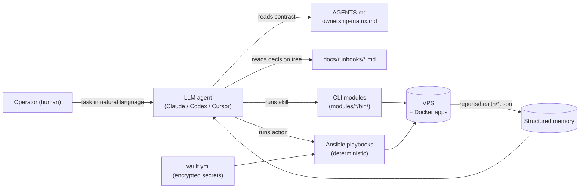

# PraefectusAI


[](LICENSE)
[](https://docs.ansible.com/)
[](#)

**A universal framework for AI-augmented VPS and application administration.**

Run your VPS the way an LLM agent can safely help you operate it.
Ansible playbooks for deterministic actions. Markdown runbooks for decisions.
CLI tools as agent skills. Vault + scoped permissions as guardrails.
Built around the [`AGENTS.md`](AGENTS.md) contract pattern — works with Claude Code, Codex, Cursor, and any LLM agent that follows instructions. Bring your own VPS (single host or small fleet); the patterns scale.

---

## The name

In Roman administration, a **praefectus** was an officer appointed by a higher authority — never replacing the principal, always acting on their behalf within an explicit mandate. The *Praefectus Annonae* kept the grain supply moving. The *Praefectus Urbi* ran the city in the emperor's name. The *Praefectus Praetorio* ran the imperial household.

The role worked because of three things: structured authority (a written mandate, not vague trust), narrow scope (one domain, well-bounded), and faithful reporting back (the principal always knew what had been done in their name).

That is exactly what an LLM agent should be when it touches production infrastructure: an extension of the operator's intent within a clear contract, not a substitute for their judgment. **PraefectusAI** is that contract — `AGENTS.md` as the mandate, `ownership-matrix.md` as the scope, `reports/` and `docs/journal/` as the faithful record back to the operator.

---

## Why PraefectusAI exists

Operating a Linux VPS is ten percent emergencies and ninety percent the same checks: disk, memory, expiring certs, container health, log rotation, secret hygiene. That ninety percent is exactly what a competent LLM agent can handle — *if* the operator can encode the rules.

Most LLM-agent demos are toy: an agent given root SSH access, a vague prompt, and a hope that nothing important breaks. Production teams don't run that. They want:

- Hard limits on what the agent can do
- A clear inventory of who owns what
- Deterministic, auditable actions (not freeform shell)
- Read-only by default, with explicit elevation
- A scanner that catches the operator (and the agent) before a real IP or token reaches `git push`

PraefectusAI is the structured knowledge base + skill set that gives an agent enough context to be useful and enough boundaries to stay safe. It's been running production VPS workloads — the patterns are battle-tested, not whiteboarded.

---

## Architecture at a Glance



Three layers, isolated by intent:

- **Knowledge** — `AGENTS.md`, `docs/ownership-matrix.md`, `docs/runbooks/*.md`. The agent reads these before acting. Hard rules, decision trees, scope boundaries.
- **Actions** — `ansible/playbooks/*.yml` (deterministic, idempotent) + `modules/*/bin/*` (CLI skills). Every mutating action requires explicit operator approval; read-only checks run freely.
- **Memory** — `reports/health/*.json` (structured, machine-readable) + `docs/journal/<YYYY-MM>.md` (manual operator notes). The agent reads these to know history.

Secrets live encrypted in `ansible/secrets/vault.yml`; the vault password lives only on the operator's machine.

---

## The AGENTS.md contract pattern

`AGENTS.md` is the system prompt of this repository. Every LLM agent — regardless of which CLI it runs in — reads it first.

It encodes:

- **Karpathy-style workflow rules** — read first, minimal change, surgical edits, verifiable goals
- **Hard safety limits** — never `git push --force`, never `docker volume prune`, never edit `/opt/<app>/docker-compose.yml`
- **Secrets policy** — what counts as a secret, where they live, how to reference them in docs
- **Architecture invariants** — what assumptions must hold across all changes

The result is a small, predictable surface area. The agent does not invent new ways to break things.

See [`AGENTS.md`](AGENTS.md) for the full contract.

---

## What's in the box

### Playbooks (`ansible/playbooks/`)

| # | Playbook | Purpose | Mutating? |
|---|---|---|---|
| 10 | `10-disk-cleanup.yml` | One-shot cleanup: apt clean, journal vacuum, filtered docker prune, logrotate. Volumes untouched. | yes |
| 11a | `11-periodic-cleanup-setup.yml` | Installs `/usr/local/bin/vps-periodic-cleanup.sh` + systemd timer (Sun 03:00 UTC). | yes (one-shot setup) |
| 11b | `11-schedule-cleanup.yml` | Alternative weekly cleanup timer with `/var/log/vps-weekly-cleanup.log`. | yes (one-shot setup) |
| 20 | `20-monitoring.yml` | Deploys Python poller + systemd timer (5 min). Sends Telegram alerts on `WARN` / `CRIT`. | yes |
| 30 | `30-backup.yml` | restic + B2: encrypted offsite backups of application data. Daily timer at 02:00 UTC. | yes (one-shot setup) |
| 40 | `40-security.yml` | `fail2ban` (sshd jail), `unattended-upgrades` (`-security` only), sshd `MaxSessions` enforcement, UFW audit. | yes |
| 50 | `50-syncthing-audit.yml` | Reports `*.sync-conflict-*`, large files, peer status. Writes `reports/syncthing-audit-*.md`. | read + report |
| 60 | `60-docker-limits.yml` | `mem_limit` overrides for less-critical containers. | yes (no auto-restart) |
| 70 | `70-docker-limits-critical.yml` | `mem_limit` for critical services with immediate `docker update --memory`. | yes |
| 99 | `99-verify.yml` | Read-only health gate. 12 checks. Emits `reports/health/*.json` + `reports/verify-*.md`. | **no** |

Before any mutating playbook, run `--check --diff` and review the output. See [`AGENTS.md`](AGENTS.md) safety rules.

### CLI modules (`modules/<name>/bin/`)

| Command | Purpose |
|---|---|
| `./verify.sh` | Wrapper over `99-verify.yml`. Full health check in seconds. |
| `./modules/dashboard/bin/update-dashboard` | Reads latest `reports/` and rebuilds `docs/dashboard.md`. |
| `./modules/disk-observatory/bin/disk-report` | Standalone (no Ansible) SSH into VPS for `df` / `du` / `docker df`. |
| `./modules/health-trends/bin/health-trend` | Trend analysis over the last N `reports/health/*.json`. |
| `./modules/maintenance-journal/bin/cleanup-fetch` | Pulls weekly cleanup logs into `reports/maintenance/<YYYY-MM>.md`. |
| `./modules/monitoring/bin/run-check` | Manual run of `vps-monitor.py`. Flags: `--test-alert`, `--log`, `--status`. |
| `./modules/port-audit/bin/port-audit` | Compares live `ss -tlnp` against `docs/ports.md`. Flags new / unsafe bindings. |
| `./modules/secrets-management/bin/secret-scan` | Scans the repo for leaked IPs, keys, tokens. **Run before every commit.** |

---

## Quick Start

### 1. Install dependencies on the control machine (one-time)

```bash
# macOS
brew install ansible git-filter-repo
ansible-galaxy collection install -r ansible/requirements.yml

# Linux
sudo apt install ansible git
pip install --user git-filter-repo
```

### 2. Provision the vault password

```bash
# Generate a 32-character vault password
pwgen -s 32 1 > ~/.vault_pass.txt
chmod 600 ~/.vault_pass.txt

# Back it up to your password manager — vault loss is unrecoverable.
```

### 3. Fill in the vault

```bash
cp ansible/secrets/vault.yml.example ansible/secrets/vault.yml
# Edit ansible/secrets/vault.yml with your real values:
#   vault_vps_host, vault_vps_user, vault_ssh_private_key_file, vault_b2_*, vault_tg_*
ansible-vault encrypt ansible/secrets/vault.yml
```

### 4. Smoke test

```bash
cd ansible
ansible -i inventory/production.yml vps -m ping
# Expected: vps-prod | SUCCESS => {"ping": "pong"}
```

### 5. Read-only health check

```bash
./verify.sh
# Expected: all checks pass, exit 0
```

### 6. First mutating action — free disk

```bash
cd ansible
ansible-playbook playbooks/10-disk-cleanup.yml --check --diff   # dry-run
# Review output, especially docker prune lines
ansible-playbook playbooks/10-disk-cleanup.yml                  # apply
./verify.sh                                                      # services should still be up
```

---

## Demo

Sanitised real outputs from a production deployment live in [`examples/`](examples/):

- `examples/sample-verify-output.md` — full `verify.sh` output
- `examples/sample-dashboard.md` — generated dashboard
- `examples/sample-health-trend.txt` — `health-trend --last 10` output
- `examples/sample-disk-report.md` — disk report
- `examples/sample-cleanup-log.md` — weekly auto-cleanup excerpt
- `examples/sample-monitor-alert.md` — what a Telegram alert looks like
- `examples/sample-secret-scan.txt` — `secret-scan` catching simulated leaks

Open any of those to see what the framework produces without provisioning a VPS.

---

## Architecture Decisions

The *why* behind the patterns lives in [`docs/adr/`](docs/adr/):

| ADR | Decision |
|---|---|
| [0001](docs/adr/0001-host-vs-app-ownership.md) | Host-vs-app ownership boundary |
| [0002](docs/adr/0002-vault-as-single-source-of-truth.md) | Vault as the single source of truth for secrets |
| [0003](docs/adr/0003-read-only-by-default.md) | Read-only by default; mutating requires explicit elevation |
| [0004](docs/adr/0004-raw-module-for-ssh-pipelining.md) | `raw` module + `gather_facts: false` for SSH pipelining compatibility |
| [0005](docs/adr/0005-override-files-as-host-policy-zone.md) | `docker-compose.override.local.yml` as host-policy boundary |
| [0006](docs/adr/0006-agents-md-contract-pattern.md) | `AGENTS.md` as a hard contract for LLM agents |

---

## Security Model

PraefectusAI is single-operator by design. The threat model assumes a trusted control machine, encrypted vault for every credential, and explicit recovery boundaries.

See [`SECURITY.md`](SECURITY.md) for the full threat-model table, mitigations, and recovery scenarios.

---

## Documentation Index

| Document | Topic |
|---|---|
| [`docs/architecture.md`](docs/architecture.md) | Host-vs-app model, where things live |
| [`docs/ownership-matrix.md`](docs/ownership-matrix.md) | Who owns what on the VPS |
| [`docs/overview.md`](docs/overview.md) | Full repo navigation index |
| [`docs/dashboard.md`](docs/dashboard.md) | Current state snapshot (regenerated) |
| [`docs/containers.md`](docs/containers.md) | Container inventory + memory limits |
| [`docs/ports.md`](docs/ports.md) | Canonical port map |
| [`docs/firewall.md`](docs/firewall.md) | UFW rules |
| [`docs/runbooks/`](docs/runbooks/) | Incident decision trees |
| [`docs/adr/`](docs/adr/) | Architecture Decision Records |

---

## Contributing

PraefectusAI welcomes contributions. Read [`CONTRIBUTING.md`](CONTRIBUTING.md) for the workflow, conventional-commit format, and pre-commit hooks.

Highlights:

- Run `./modules/secrets-management/bin/secret-scan` before every commit.
- Run `ansible-playbook --syntax-check ansible/playbooks/*.yml` before pushing playbook changes.
- Open an ADR for any architectural shift.

---

## License

[MIT](LICENSE) © 2026 Denis Ermilov
