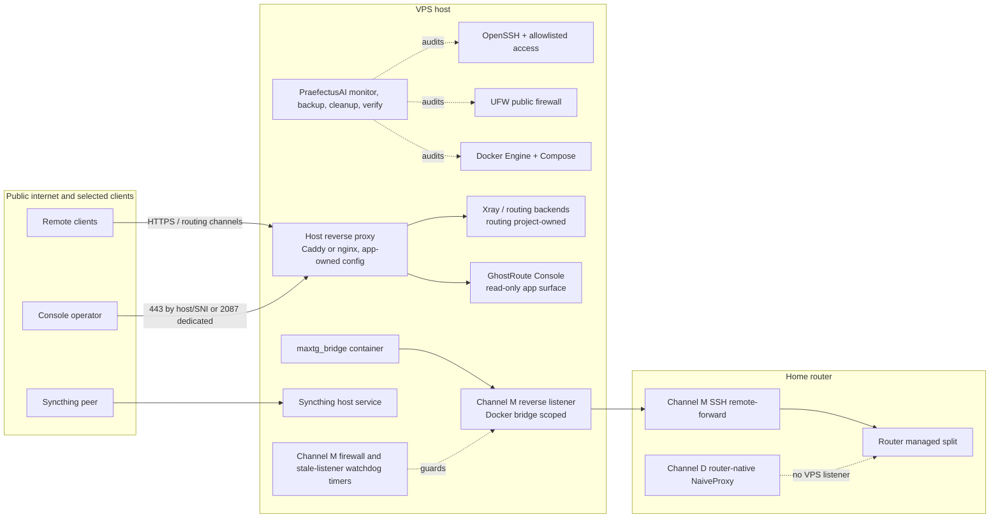
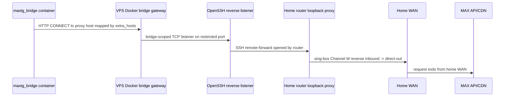
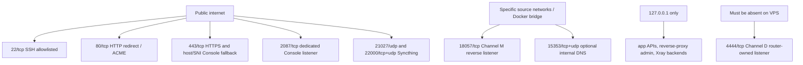
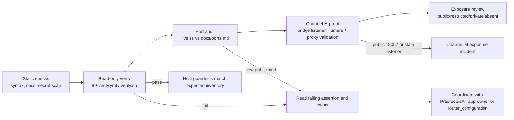
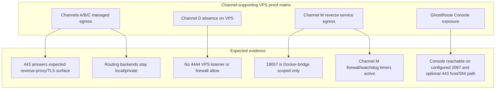

# VPS Runtime Map

This document is the operator-facing map of what PraefectusAI records and
protects on the VPS side of the current GhostRoute/channel setup. It mirrors
the router-side runtime map in `router_configuration`, but keeps the VPS
ownership boundary explicit: PraefectusAI owns the host layer, while routing
projects and application projects own their own reverse proxy, tunnel and app
runtime.

This is a sanitized expected-runtime view plus a read-only software baseline.
Real public IPs, SSH users, SSH ports, provider firewall values, tokens and app
secrets stay in Ansible Vault, application-owned secrets, or gitignored
reports.

For machine-readable guardrails, see
[`ansible/inventory/production.yml`](/ansible/inventory/production.yml),
[`docs/ports.md`](/docs/ports.md) and
[`docs/ownership-matrix.md`](/docs/ownership-matrix.md). For live verification,
run `./verify.sh --limit vps-hetzner-prod` and
`./modules/port-audit/bin/port-audit --host vps-hetzner-prod`.

## At A Glance



## VPS Role In The Channel Setup

| Channel / surface | VPS responsibility | Owner on VPS | Guardrail |
|---|---|---|---|
| Channel A managed egress | Provides remote Reality/Vision egress surface behind public HTTPS routing | routing project | PraefectusAI records ports and host health; it does not own routing config |
| Channel B selected-client lane | Provides local Xray/XHTTP backend and reverse-proxy exposure where configured | routing project | local-only backend ports; public exposure only through documented reverse proxy |
| Channel C home-first compatibility | VPS is not the first hop; it remains the managed egress after router split | routing project | no extra public VPS listener beyond documented HTTPS surface |
| Channel D router-native NaiveProxy | No VPS listener; first hop is home router WAN to router Caddy `forward_proxy@naive` | `router_configuration` | `4444/tcp` must not appear on the VPS or in UFW/cloud firewall |
| Channel M reverse MAX egress | Hosts the Docker-bridge-scoped SSH reverse listener consumed by `maxtg_bridge` | `router_configuration` / `maxtg_bridge` | `18057/tcp` must bind only on the Docker bridge, with watchdog timers active |
| GhostRoute Console | Read-only operator UI served by dedicated `2087/tcp` and optionally by host/SNI on `443/tcp` | routing / app owner | PraefectusAI records exposure, health and port inventory only |

## Host-Owned Runtime Objects

| Area | Runtime objects | Installed or rendered by | Verification signal |
|---|---|---|---|
| SSH access | `/etc/ssh/`, `/home/deploy/.ssh/authorized_keys` | `00-bootstrap.yml`, `40-security.yml`, Vault-backed SSH helpers | direct SSH check, MaxSessions check, scoped Channel M key preserved |
| Firewall | UFW rules, provider allowlist outside repo, Channel M non-UFW iptables exception | `40-security.yml`, `router_configuration` for Channel M exception | UFW active, public ports match `docs/ports.md`, `18057` not public |
| Docker host | Docker Engine, Compose plugin, `/var/lib/docker` | bootstrap and host maintenance playbooks | Docker active, no current-boot ordering cycle; filtered cleanup only; volumes never pruned automatically |
| Monitoring | `/usr/local/bin/vps-monitor.py`, systemd timer | `20-monitoring.yml` | 5-minute health checks and Telegram alerting |
| Cleanup | `/usr/local/bin/vps-periodic-cleanup.sh`, `vps-cleanup.timer` | `11-periodic-cleanup-setup.yml` | apt/journal/docker cleanup with retention filters; no volume prune |
| Backups | restic config/timers, app-data backup paths | `30-backup.yml` | backup timer/status checks; encrypted remote snapshots |
| Syncthing | Syncthing service and config under deploy home | PraefectusAI host layer | public sync/discovery ports documented; Web UI loopback-only |
| App resource policy | `docker-compose.override.local.yml` beside app compose files | `60-docker-limits.yml`, `70-docker-limits-critical.yml` | Docker inspect and verify reports show memory/CPU/PID limits |

## Cross-Project Runtime Objects

| Runtime object | Location | Owner | PraefectusAI stance |
|---|---|---|---|
| Host reverse proxy config | `/etc/caddy/` or `/etc/nginx/` | app/routing project | record and audit; do not overwrite |
| GhostRoute Console container/app | app-owned Docker runtime | routing/app owner | verify listener and health; do not deploy app internals |
| Xray / routing local backends | local loopback ports, routing containers | routing project | record ports; no config ownership |
| `maxtg_bridge` app | `/opt/maxtg-bridge/` | `maxtg_bridge` | host limits/backups only; app compose/env remain app-owned |
| Channel M SSH policy | `/etc/ssh/sshd_config.d/51-channel-m-reverse.conf` | `router_configuration` | preserve during SSH hardening; verify file exists |
| Channel M firewall helper | `/usr/local/sbin/channel-m-reverse-firewall.sh` | `router_configuration` | preserve; verify helper and timer |
| Channel M stale-listener watchdog | `/usr/local/sbin/channel-m-reverse-listener-watchdog.sh` | `router_configuration` | preserve; verify helper and timer |

## Host Scope

| Inventory host | Runtime role | Channel-specific guardrails |
|---|---|---|
| `vps-hetzner-prod` | Main app/routing VPS for `maxtg_bridge`, GhostRoute Console, OpenClaw/LightRAG and related app workloads | Channel M files/timers expected; restricted `18057/tcp` bridge listener expected; Channel D `4444/tcp` absent |
| `vps-hostkey-hermes` | Separate workload host plus GhostRoute owned managed-egress candidate | `/opt/stealth`, `caddy`, `xray` expected after egress deploy; no Channel M reverse listener expected; Channel D `4444/tcp` absent |

## Installed Software Versions

Last read-only snapshot: 2026-06-13 from `vps-hetzner-prod`.
This table records only software identity and version data. It intentionally
excludes public IPs, SSH values, provider firewall state, app tokens and live
endpoint URLs.

| Component | Observed version | Source |
|---|---|---|
| OS | Ubuntu `24.04.4 LTS` | `/etc/os-release` |
| Linux kernel | `6.8.0-117-generic` | `uname -r` |
| systemd | `255` (`255.4-1ubuntu8.16`) | `systemctl --version` |
| Docker Engine | `29.3.1`, build `c2be9cc` | `docker --version` |
| Docker Compose plugin | `v5.1.1` | `docker compose version` |
| OpenSSH client/server | `9.6p1 Ubuntu-3ubuntu13.16`, OpenSSL `3.0.13` | `ssh -V`, `sshd -V` |
| UFW | `0.36.2` | `ufw version` |
| Fail2Ban | `1.0.2` | `fail2ban-client --version` |
| Caddy | `v2.11.1` | `caddy version`; checksum omitted from docs |
| nginx | `1.24.0` (Ubuntu) | `nginx -v` |
| Syncthing | `1.30.0` | `syncthing --version` |
| restic | `0.16.4` | `restic version` |
| Python | `3.12.3` | `python3 --version` |
| iptables | `1.8.10` (`nf_tables`) | `iptables --version` |
| nftables | `1.0.9` | `nft --version` |

Treat this as a baseline for the referenced host, not a fleet-wide assertion.
Record a new snapshot after OS, Docker, reverse-proxy or Syncthing upgrades.

## Channel M Reverse MAX Egress



The VPS must not expose Channel M publicly. `99-verify.yml` checks that the
listener is present only as a restricted Docker-bridge listener, that the
firewall helper/timer are active, and that the listener watchdog timer is active.

## Exposure Model



Public-by-design exceptions are documented in `docs/ports.md`. Everything else
should be loopback-only, bridge-scoped, source-restricted or absent.

## Test Schemes





Interpretation:

- A/B/C proof on the VPS is about the remote egress/reverse-proxy surface and
  local backend exposure. The router remains the first-hop policy owner for
  home-first channels.
- Channel D proof on the VPS is negative: no `4444/tcp`, no UFW/cloud allow, no
  expected VPS listener.
- Channel M proof is positive but restricted: `18057/tcp` exists only on the
  compose Docker bridge path, with router-owned firewall and stale-listener
  recovery active.
- Console proof is read-only operator access: standard HTTPS can host/SNI route
  to the Console, while `2087/tcp` remains the documented dedicated listener.

## Read-Only Verification Checklist

```bash
./verify.sh --limit vps-hetzner-prod
./modules/port-audit/bin/port-audit --host vps-hetzner-prod
cd ansible
ansible-playbook --syntax-check playbooks/99-verify.yml
```

Expected healthy signals:

- Disk, memory, Docker daemon and UFW checks are OK or explained by the health
  report.
- Expected Channel M host files exist and are owned by the routing project.
- `channel-m-reverse-firewall.timer` and
  `channel-m-reverse-listener-watchdog.timer` are enabled and active.
- `18057/tcp` is restricted to the Docker bridge and never public.
- `4444/tcp` is absent from the VPS listener set.
- App API ports remain loopback/private unless intentionally documented as
  public in `docs/ports.md`.

If a live check disagrees with this map, treat it as drift evidence. Identify
the owner first, then choose the right repo/playbook; do not edit app-owned
compose files or routing-owned reverse-proxy config from PraefectusAI.

## Related Docs

- [`architecture.md`](/docs/architecture.md) - host-vs-app model and channel runtime schemes.
- [`ports.md`](/docs/ports.md) - canonical port map and `port-audit` source of truth.
- [`firewall.md`](/docs/firewall.md) - UFW and non-UFW Channel M exception model.
- [`containers.md`](/docs/containers.md) - container inventory and resource limits.
- [`ownership-matrix.md`](/docs/ownership-matrix.md) - path ownership and modification boundaries.
- [`runbooks/ssh-breakglass-bastion.md`](/docs/runbooks/ssh-breakglass-bastion.md) - SSH route recovery.
- [`runbooks/disk-full.md`](/docs/runbooks/disk-full.md) - safe cleanup flow.
